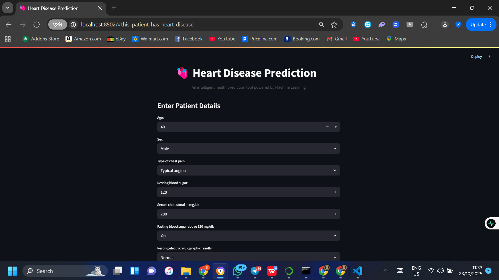
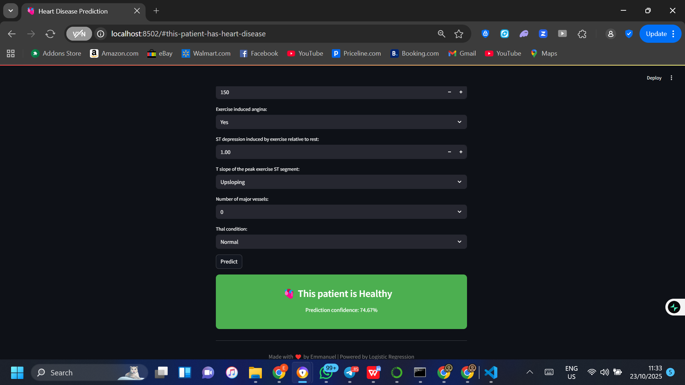

🫀 Heart Disease Prediction Web App

Overview

This project is a Machine Learning-based web application that predicts the likelihood of a patient having heart disease based on their medical data.
It uses a Logistic Regression model trained on the UCI Heart Disease dataset, deployed with Streamlit for an interactive user interface.

⸻

Features

 • Predict heart disease risk using 13 medical input features.

 • Machine Learning model: Logistic Regression optimized with GridSearchCV.

 • Standardized inputs: Uses StandardScaler for data consistency.

 • Interactive UI: Built with Streamlit for real-time predictions.

 • Modern design: Custom colors, icons, and styled result display.

 • Confidence score: Displays model’s prediction probability.

⸻

Tech Stack

Component Technology
Programming Language Python
Machine Learning Scikit-learn
Data Handling NumPy, Pandas
Model Deployment Streamlit
Model Persistence Joblib
Dataset UCI Heart Disease Dataset

⸻

Model Development Workflow
 1. Data Preprocessing
 • Handled missing values and categorical encoding.
 • Scaled features using StandardScaler.
 2. Model Training
 • Tested multiple models: Logistic Regression, Random Forest, and SVM.
 • Used GridSearchCV to find the best hyperparameters.
 • Logistic Regression achieved the highest accuracy (≈75%).
 3. Model Evaluation
 • Metrics used: Accuracy, Precision, Recall, F1-score.
 • Final model and scaler saved using joblib.
 4. Deployment
 • Integrated model into a Streamlit app.
 • Added real-time input forms and a predictive output card.

⸻

🧰 Installation & Setup

1️⃣ Clone the repository

git clone https://github.com/HayTyrant/Heart-Disease.git
cd heart-disease-prediction

2️⃣ Create a virtual environment

python -m venv venv
venv\Scripts\activate    # For Windows
source venv/bin/activate # For Mac/Linux

3️⃣ Install dependencies

pip install -r requirements.txt

4️⃣ Run the app

streamlit run app.py

⸻

How It Works
 1. User enters patient details (age, sex, chest pain type, etc.)
 2. Inputs are encoded and scaled using the saved StandardScaler.
 3. The trained Logistic Regression model predicts the outcome.
 4. The result is displayed as:
 • 🫀 “This patient has heart disease” (if prediction = 1)
 • 🫀 “This patient does not have heart disease” (if prediction = 0)

⸻

Sample UI

⸻

File Structure

Heart_Disease_Prediction/
• app.py                     # Streamlit web app

• grid.pkl                   # Saved trained model

• scaler.pkl                 # Saved StandardScaler

• requirements.txt           # Dependencies

• README.md                  # Project documentation

⸻

Author

Emmanuel Olusolade
📍 Data Science Enthusiast | Machine Learning Explorer

💼 LinkedIn (https://linkedin.com/EmmanuelOlusolade)

🐦 Twitter (X (https://twitter.com/HayTyrant))

📧 Email (Emmanuelayomikun02@gmail.com)

⸻

🏁 Future Improvements

 •  Integrate additional health metrics (e.g., blood sugar history).

 •  Add data visualization dashboard.

 •  Deploy on Streamlit Cloud or Hugging Face Spaces.

 •  Add input validation and improved error handling.

⸻

License

This project is licensed under the MIT License.

